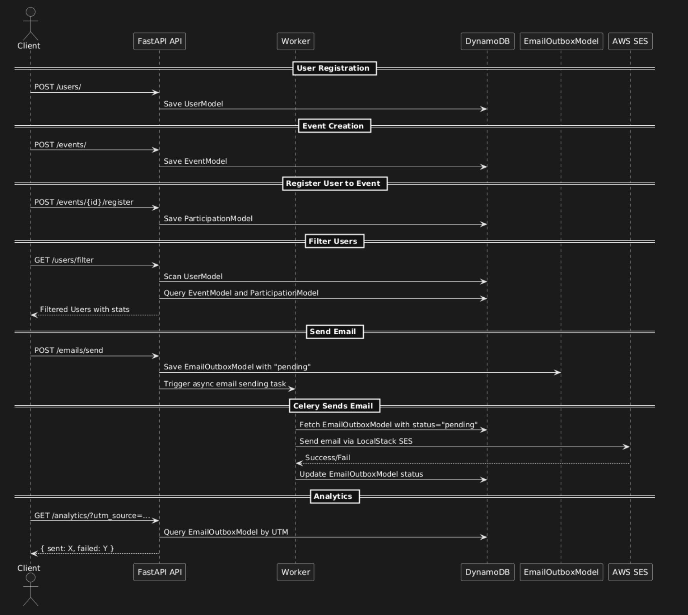
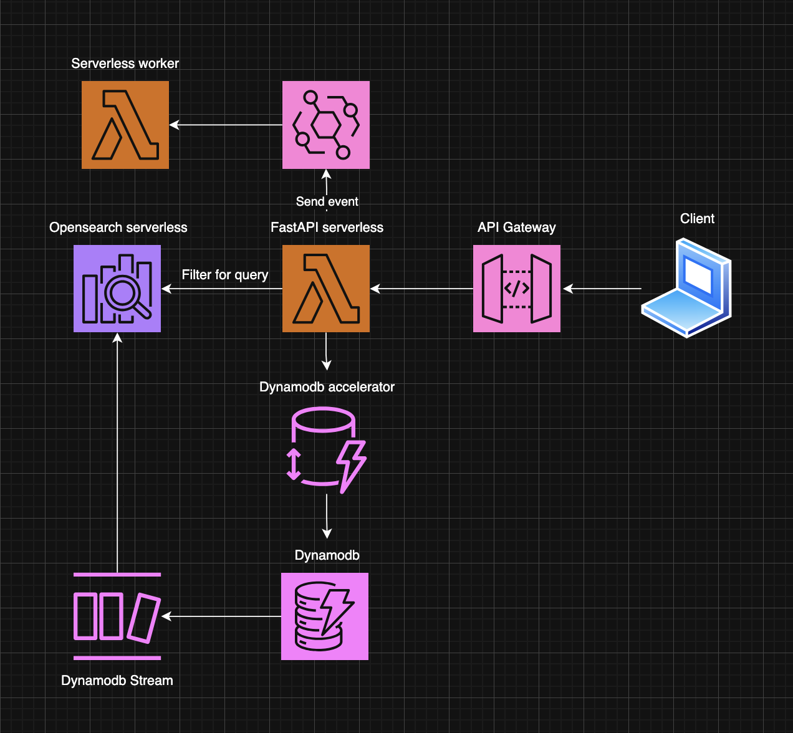

# Simple demo event management CRM

## Key Features

- User and event data management (CRUD)
- Registration tracking
- Filtering and analytics on user engagement
- Transactional outbox pattern for email sending via worker
- UTM-based email performance tracking

## Technology Stack

- Python 3.12
- FastAPI
- Celery
- PynamoDB (DynamoDB ORM)
- DynamoDB
- AWS SES
- Localstack (for test)
- Docker + Docker Compose

## Sequence Diagram



## Limitations of DynamoDB

### ❗ Requirement: Efficient querying on large datasets  
While DynamoDB offers high scalability and low-latency lookups, it is **not well-suited** for flexible, multi-attribute queries over large datasets, especially when combining multiple filters dynamically (e.g., `job_title`, `company`, `city`, `state`).

### ❗ Requirement: Combine multiple filters in a single query  
To support all filter combinations with high performance in DynamoDB, we would need to create multiple GSIs (Global Secondary Indexes). However, this quickly becomes expensive and hard to manage as filter permutations grow.

## Suggestion for Improvement

### ✅ Use OpenSearch for Advanced Filtering & Analytics

I recommend offloading filtering and analytical workloads to **OpenSearch**, which supports:

- Full-text search
- Boolean queries with multiple filters
- Aggregations for UTM-based analytics
- Near real-time indexing of events and users

This approach provides:

- Lower cost for complex filtering
- Much faster query performance on large datasets
- Better support for future analytical features

### Data Sync Strategy

We can sync changes from DynamoDB to OpenSearch using: DynamoDB Streams

## Suggestion Architecture




## 📬 Sample API Requests

### 📌 1. Create User
```bash
curl -X POST http://localhost:8000/users \
  -H "Content-Type: application/json" \
  -d '{
    "firstName": "Alice",
    "lastName": "Johnson",
    "email": "alice@example.com",
    "phoneNumber": "1234567890",
    "avatar": "https://example.com/avatar.jpg",
    "gender": "female",
    "jobTitle": "Engineer",
    "company": "TechCorp",
    "city": "New York",
    "state": "NY"
  }'


### 📌 2. Create Event
```bash
curl -X POST http://localhost:8000/events \
  -H "Content-Type: application/json" \
  -d '{
    "title": "Tech Conference 2025",
    "slug": "tech-conf-2025",
    "description": "A major tech event.",
    "startAt": "2025-08-01T09:00:00Z",
    "endAt": "2025-08-01T17:00:00Z",
    "venue": "NYC Convention Center",
    "maxCapacity": 200,
    "owner": "user-id-123",
    "hosts": ["user-id-123"]
  }'


### 📌 3. Register User to Event
```bash
curl -X POST http://localhost:8000/events/event-id-123/register \
  -H "Content-Type: application/json" \
  -d '{"user_id": "user-id-456"}'


### 📌 4. Filter Users
```bash
curl -G http://localhost:8000/users/filter \
  --data-urlencode "company=TechCorp" \
  --data-urlencode "city=New York" \
  --data-urlencode "events_attended_min=1" \
  --data-urlencode "events_hosted_min=0" \
  --data-urlencode "sort_by=-firstName" \
  --data-urlencode "limit=20"


### 📌 5. Send Email to Users
```bash
curl -X POST http://localhost:8000/emails/send \
  -H "Content-Type: application/json" \
  -d '{
    "filter": {
      "company": "TechCorp",
      "city": "New York"
    },
    "subject": "Join our next event!",
    "body": "We invite you to our upcoming tech conference.",
    "utm_source": "newsletter",
    "utm_medium": "email",
    "utm_campaign": "tech_conf_2025"
  }'


### 📌 6. View Analytics by UTM
```bash
curl -G http://localhost:8000/analytics/ \
  --data-urlencode "utm_source=newsletter" \
  --data-urlencode "utm_medium=email" \
  --data-urlencode "utm_campaign=tech_conf_2025"
